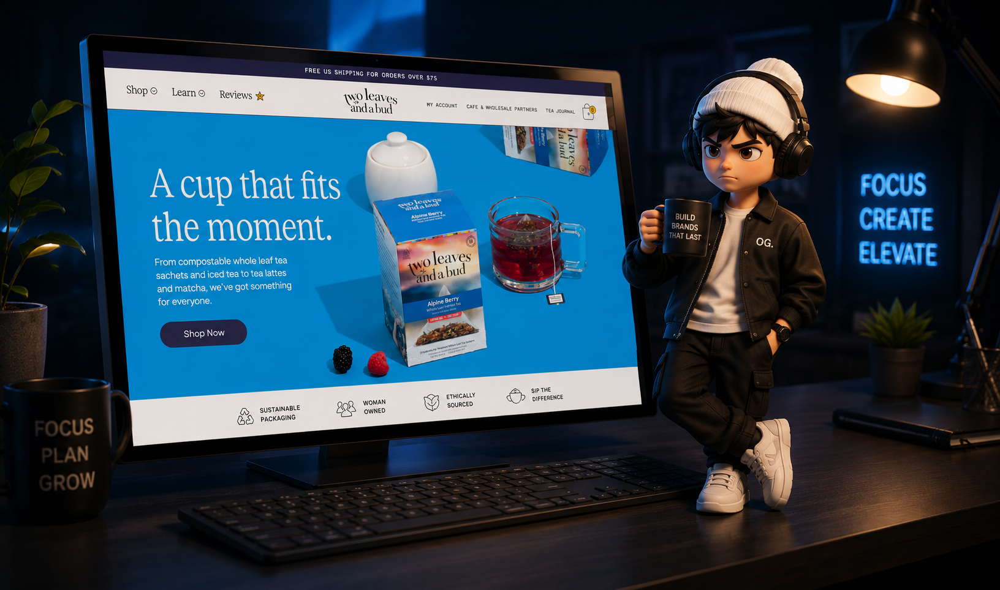

# Two Leaves and a Bud — Tea Brand Landing Page Clone

A pixel-faithful clone of the **Two Leaves and a Bud** tea brand website, built using **only HTML & CSS — no JavaScript.**
Created as part of **Sheryians Coding School, Cohort 3.0** assignment.

---

## 🌐 Live Demo

[View Live Project →](https://two-leaves-tea-two.vercel.app)

---

## 📸 Preview

---

## 🚀 What I Built

The assignment was to replicate the Two Leaves and a Bud reference design using HTML and CSS.

I rebuilt the entire visual experience — from the sticky floating header to the full-page forest scroll section — without touching a single line of JavaScript. Every interaction, transition, and layout behavior is driven purely by CSS.

---

## ✨ Features

- **Sticky floating header** — rounded card-style navbar with border, shadow, and a fixed-on-scroll state (`header.stuck`) — all layout-driven, zero JS
- **Full-viewport hero section** — background image with layered headline, subtext, and CTA; separate mobile/desktop image sources via CSS
- **Horizontal scrolling product showcase** — 12-column CSS Grid carousel with scroll-snap, custom-colored product cards, and quick-add buttons
- **"Discover Your Tea" filter section** — vibe-chip UI with mood/flavor tags, fully styled with hover states
- **Parallax-style forest section** — sticky scroll storytelling with overlaid text, values grid, and a full-height background image
- **Customer reviews carousel** — horizontally scrollable review cards with star ratings and verified badge styling
- **Cafe & Barista product sections** — split-layout grid with floating badge, product image shadow, and sliding content panel
- **Tea Journal blog grid** — card-based article layout with category tags and hover overlays
- **Collapsible footer** — accordion-style menus on mobile, full 4-column grid on desktop; email signup form with social icons
- **Custom fonts** — Reckless, Figtree, Roboto Mono, and Midnight Sans loaded via `@font-face`
- **Mobile-first responsive design** — structured breakpoints at 768px and 1100px+, every section reflowing cleanly
- **Zero dependencies** — no frameworks, no libraries, no JavaScript

---

## ⚠️ Real Challenges I Faced

**1. Sticky header without JavaScript**
The reference design has a header that changes shape when scrolled. I engineered a CSS-only approximation using `position: fixed`, class toggling via the `.stuck` state, and a placeholder div to prevent layout shift — without any scroll event listener.

**2. Hero layering across breakpoints**
The hero uses a background image on mobile and a real `` tag on desktop (for `object-fit: cover` control). Getting both to look correct with a floating header overlapping the top required careful `margin-top: -100px` and z-index management.

**3. Horizontal scroll product grid**
Building a 12-column grid that scrolls horizontally, snaps to cards, hides the scrollbar cross-browser, and still reflows to a proper grid on desktop — took multiple full rewrites of the grid logic.

**4. Forest section scroll storytelling**
The forest section uses `position: sticky` with a `min-height: 300vh` container to simulate a parallax scroll reveal. Getting the text overlays, values grid, and background image all positioned correctly across screen sizes was the hardest layout problem in the project.

**5. Collapsible footer on mobile — CSS only**
The footer menus collapse into accordions on mobile using a CSS-only toggle pattern. On desktop they expand into a 4-column grid. Achieving both states cleanly without JS required careful use of display overrides inside media queries.

**6. Custom font loading**
The design uses four distinct typefaces loaded via `@font-face` from local `.woff`, `.woff2`, `.ttf`, and `.otf` files. Getting `font-display: swap` working correctly to avoid invisible text during load was a new challenge.

---

## 📚 What I Learned

- Real-world layouts are never one section — they're 10+ independent layout systems that have to coexist
- `position: sticky` is powerful but breaks silently if a parent has `overflow: hidden` — learned this the hard way
- Mobile-first is not just a philosophy, it's a workflow — writing desktop styles on top of a solid mobile base is genuinely cleaner
- CSS custom properties and consistent naming conventions save hours of debugging across large stylesheets
- Constraints (no JS) force you to understand CSS far more deeply than tutorials ever could

---

## 🛠 Tech Used

`HTML5` &nbsp; `CSS3` &nbsp; `CSS Grid` &nbsp; `Flexbox` &nbsp; `CSS Scroll Snap` &nbsp; `Position Sticky` &nbsp; `@font-face` &nbsp; `Responsive Design` &nbsp; `CSS Transitions` &nbsp; `Mobile-First Breakpoints`

---

## 📂 How to Run

No installation required.
Download the ZIP → Extract → Open `index.html` in your browser. Done.

---

## 🌐 Connect With Me

[GitHub](https://github.com/geetansh-sirohi) · [Instagram](https://www.instagram.com/code.with.geetansh) · [LinkedIn](https://www.linkedin.com/in/geetansh-sirohi)

---
